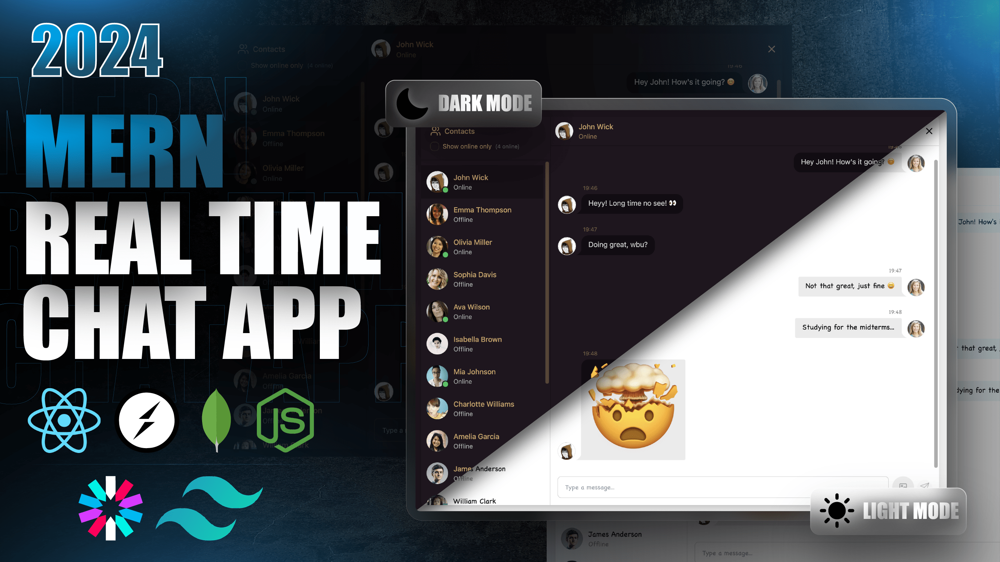

<div align="center">

# 💬 Chatty

### A Realtime Chat Application built with the MERN Stack


</div>

Chatty is a full-stack, real-time messaging app built on the MERN stack. It supports one-on-one conversations with instant delivery via Socket.IO, image sharing through Cloudinary, live online/offline presence, and a fully themeable UI with 32 switchable daisyUI themes.



---

## ✨ Features

- 🔐 **Secure authentication** — Sign up and log in with a bcrypt-hashed password. A JWT is issued and stored in an `httpOnly`, `sameSite` cookie, so it's never exposed to client-side JavaScript.
- ⚡ **Real-time messaging** — Powered by Socket.IO; new messages appear instantly for the recipient with no polling or page refresh.
- 🟢 **Live online presence** — See which contacts are online right now, with a "show online only" toggle in the sidebar.
- 🖼️ **Image sharing** — Send images in a conversation or update your profile picture; both are uploaded to Cloudinary and served from its CDN.
- 🎨 **32 switchable themes** — Pick any daisyUI theme (dark, synthwave, dracula, cyberpunk, and more) from the Settings page, with a live preview. Your choice is remembered across sessions.
- 📱 **Responsive layout** — The sidebar collapses to avatars-only on small screens, and the whole layout adapts down to mobile.
- 💀 **Skeleton loading states** — Polished placeholders for the sidebar and message list while data loads.
- 🔔 **Toast notifications** — Instant success/error feedback for every auth and messaging action.
- 🌱 **One-command demo data** — A seed script populates 15 ready-made demo accounts (with avatars) so you can test conversations right away.

## 🛠️ Tech Stack

**Frontend**

| | |
|---|---|
| Framework | React 18 + Vite |
| Routing | React Router v6 |
| State management | Zustand |
| Styling | Tailwind CSS + daisyUI |
| HTTP client | Axios |
| Real-time | Socket.IO Client |
| Notifications | React Hot Toast |
| Icons | Lucide React |

**Backend**

| | |
|---|---|
| Runtime / Framework | Node.js + Express |
| Database | MongoDB + Mongoose |
| Real-time | Socket.IO |
| Auth | JSON Web Tokens (`jsonwebtoken`) + `bcryptjs` |
| Media storage | Cloudinary |
| Middleware | `cookie-parser`, `cors`, `dotenv` |

## 📁 Project Structure

```
MERN_Chat_App/
├── backend/
│   ├── src/
│   │   ├── controllers/
│   │   │   ├── auth.controller.js      # signup, login, logout, profile update, session check
│   │   │   └── message.controller.js   # fetch conversations, send messages
│   │   ├── lib/
│   │   │   ├── cloudinary.js           # Cloudinary config
│   │   │   ├── db.js                   # MongoDB connection
│   │   │   ├── socket.js               # Socket.IO server + online-user tracking
│   │   │   └── utils.js                # JWT helper
│   │   ├── middleware/
│   │   │   └── auth.middleware.js      # route protection (verifies JWT cookie)
│   │   ├── models/
│   │   │   ├── message.model.js
│   │   │   └── user.model.js
│   │   ├── routes/
│   │   │   ├── auth.route.js
│   │   │   └── message.route.js
│   │   ├── index.js                    # app entry point
│   │   └── user_seed.js                # demo-data seed script
│   └── package.json
├── frontend/
│   ├── public/
│   │   ├── avatar.png
│   │   └── screenshot-for-readme.png
│   ├── src/
│   │   ├── components/
│   │   │   ├── skeletons/
│   │   │   ├── ChatContainer.jsx
│   │   │   ├── ChatHeader.jsx
│   │   │   ├── MessageInput.jsx
│   │   │   ├── Navbar.jsx
│   │   │   ├── NoChatSelected.jsx
│   │   │   ├── Sidebar.jsx
│   │   │   └── AuthImagePattern.jsx
│   │   ├── constants/                  # theme list
│   │   ├── lib/                        # axios instance, formatting helpers
│   │   ├── pages/
│   │   │   ├── HomePage.jsx
│   │   │   ├── LoginPage.jsx
│   │   │   ├── ProfilePage.jsx
│   │   │   ├── SettingsPage.jsx
│   │   │   └── SignUpPage.jsx
│   │   ├── store/
│   │   │   ├── useAuthStore.js         # auth state + socket connection
│   │   │   ├── useChatStore.js         # messages, contacts, subscriptions
│   │   │   └── useThemeStore.js
│   │   ├── App.jsx                     # routes
│   │   └── main.jsx
│   └── package.json
└── package.json                        # root build/start scripts
```

## ✅ Prerequisites

- **Node.js 18+** and npm
- A **MongoDB** database — local, or a free [MongoDB Atlas](https://www.mongodb.com/atlas) cluster
- A free **[Cloudinary](https://cloudinary.com/)** account, for profile picture and chat image uploads

## 🚀 Getting Started

### 1. Clone the repo

```bash
git clone https://github.com/M-Subhaaan/MERN_Chat_App.git
cd MERN_Chat_App
```

### 2. Install dependencies

```bash
npm install --prefix backend
npm install --prefix frontend
```

### 3. Configure environment variables

Create a `backend/.env` file:

```env
# Server
PORT=3000
NODE_ENV=development

# Database
MONGO_DB_URL=your_mongodb_connection_string

# Auth
JWT_SECRET=a_long_random_secret_string
JWT_SECRET_EXPIRES_IN=7d

# Cloudinary
CLOUDINARY_CLOUD_NAME=your_cloud_name
CLOUD_API_KEY=your_cloudinary_api_key
CLOUD_API_SECRET=your_cloudinary_api_secret
```

> ⚠️ **Heads up:** this repo doesn't currently include a `.gitignore`. Add one covering `node_modules/` and `.env` before you commit, so you don't accidentally push dependencies or secrets.
>
> Keep `PORT=3000` and run the frontend on its default port `5173` — the backend's CORS and Socket.IO config are hardcoded to `http://localhost:5173`, and the frontend's API/socket URLs are hardcoded to `http://localhost:3000` in development.

### 4. Run in development

Two terminals — one per app:

```bash
# Terminal 1 — backend, http://localhost:3000
cd backend
npm run dev
```

```bash
# Terminal 2 — frontend, http://localhost:5173
cd frontend
npm run dev
```

Open `http://localhost:5173` in your browser.

### 5. (Optional) Seed demo accounts

Populate the database with 15 ready-made users (all with password `123456`):

```bash
cd backend
node src/user_seed.js
```

### 6. Build & run for production

From the project root:

```bash
npm run build   # installs both apps' deps and builds the frontend
npm start        # starts Express, serving the built frontend + the API
```

With `NODE_ENV=production`, Express serves `frontend/dist` directly, so the whole app runs from a single port — handy for deploying to a single service (Render, Railway, a VPS, etc.).

## 🔌 API Reference

All endpoints are prefixed with `/api`. Protected routes require a valid `jwt` cookie, set automatically on signup/login.

**Auth — `/api/auth`**

| Method | Endpoint | Protected | Description |
|---|---|---|---|
| POST | `/signup` | – | Create an account |
| POST | `/login` | – | Log in, receive the auth cookie |
| POST | `/logout` | – | Clear the auth cookie |
| PUT | `/update-profile` | ✅ | Upload/update the profile picture |
| GET | `/check` | ✅ | Return the current logged-in user |

**Messages — `/api/messages`**

| Method | Endpoint | Protected | Description |
|---|---|---|---|
| GET | `/users` | ✅ | List all users for the sidebar (excluding yourself) |
| GET | `/:id` | ✅ | Get the message history with a specific user |
| POST | `/send/:id` | ✅ | Send a text and/or image message to a user |

## ⚡ Real-time Events

When a client connects, it passes its `userId` as a Socket.IO query param. The server keeps an in-memory `userId → socket.id` map and uses it to target events at a specific user.

| Event | Direction | Payload | Description |
|---|---|---|---|
| `getOnlineUsers` | Server → all clients | `string[]` of user IDs | Broadcast whenever a user connects or disconnects |
| `newMessage` | Server → recipient | message object | Pushed the instant a message is sent, if the recipient is online |

## 🤝 Contributing

Contributions are welcome:

1. Fork the repo
2. Create a feature branch (`git checkout -b feature/your-feature`)
3. Commit your changes
4. Open a pull request

## 👤 Author

**CH Subhan** ([@M-Subhaaan](https://github.com/M-Subhaaan))
